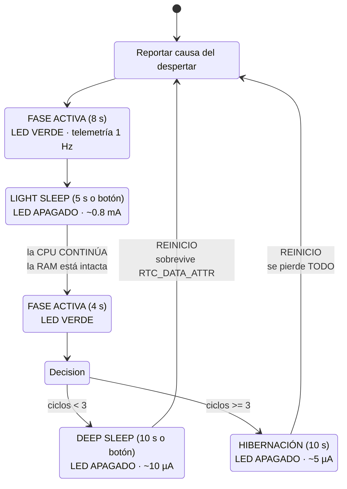

# Tarea #6 — Gestión de Energía en el ESP32

**Sistemas Embebidos · FIEC · ESPOL**
Ejercicio 1 — Ahorro de Energía · Framework **ESP-IDF** sobre **PlatformIO**

Firmware que demuestra **tres modos de bajo consumo** del ESP32 en un solo
ciclo de ejecución, con despertar por **temporizador RTC** y por **pin externo
(ext0)**, e indicación de estado por **LED RGB** y por puerto serial.

---

## 1. Descripción del ejercicio

El sistema alterna entre fases de trabajo activo y fases de reposo, entrando
automáticamente en un modo de bajo consumo distinto en cada etapa. El objetivo
es hacer **observable** la diferencia entre los modos, no solo describirla:

| Modo | Qué le pasa a la CPU | Qué sobrevive | Consumo típico |
|---|---|---|---|
| **Light Sleep** | Se **pausa** | Toda la RAM | ~0.8 mA |
| **Deep Sleep** | Se **reinicia** | Solo `RTC_DATA_ATTR` | ~10 µA |
| **Hibernación** | Se **reinicia** | **Nada** | ~5 µA |

Cifras tomadas de la **Tabla 4-2 (Power Consumption by Power Modes)** del
*ESP32 Series Datasheet v5.2*.

### La demostración

El firmware mantiene dos contadores en paralelo:

- `s_contador_ram` — variable normal en RAM.
- `s_ciclos` — variable marcada con `RTC_DATA_ATTR` (memoria RTC lenta).

Observando ambos después de cada modo de sueño se comprueba en vivo la
diferencia entre los tres modos:

```
Después de LIGHT SLEEP  →  contador_ram CONSERVA su valor
Después de DEEP SLEEP   →  contador_ram = 0, pero s_ciclos SIGUE creciendo
Después de HIBERNACIÓN  →  ambos vuelven a 0
```

---

## 2. Ciclo de operación



### Código de colores del LED

| Color | Significado |
|---|---|
| 🟢 Verde | Fase activa — consumo máximo |
| 🔵 Azul (3 destellos) | Transición a light sleep |
| 🔴 Rojo (3 destellos) | Transición a deep sleep |
| 🟣 Magenta (4 destellos) | Transición a hibernación |
| ⚫ Apagado | El sistema está durmiendo |

> Los LEDs se apagan **siempre** antes de dormir. Un LED encendido consume
> miliamperios; el deep sleep está en microamperios. Dejarlo prendido anularía
> por completo el ahorro que se busca demostrar.

---

## 3. Cumplimiento de los requisitos técnicos

| Requisito de la guía | Dónde se cumple |
|---|---|
| Ejecutar una tarea activa durante un tiempo determinado | `fase_activa()` en `main.c` |
| Entrar en bajo consumo automáticamente | Transiciones del ciclo en `app_main()` |
| Despertar mediante un evento | Temporizador RTC **y** botón ext0 |
| Indicar estados por LED RGB o mensajes seriales | **Ambos**: `indicador.c` + telemetría por serial |
| Configuración **explícita** del modo | `energia_light_sleep()`, `energia_deep_sleep()`, `energia_hibernar()` |
| `esp_sleep_enable_timer_wakeup()` | `configurar_fuentes()` en `energia.c` |
| `esp_sleep_enable_ext0_wakeup()` | `configurar_fuentes()` en `energia.c` |
| Evidencia en hardware real (deep sleep / hibernación) | Ver §7 — protocolo de medición |
| Análisis breve del comportamiento | Ver §8 |
| Código estructurado en funciones | 3 módulos: `main`, `energia`, `indicador` |

---

## 4. Estructura del proyecto

```
Tarea6_Ahorro_Energia/
├── platformio.ini        Configuración; pines y tiempos como -D
├── CMakeLists.txt        Proyecto ESP-IDF
├── diagram.json          Circuito de Wokwi
├── wokwi.toml            Enlace al firmware compilado
├── README.md             Este archivo
├── .gitignore
├── docs/
│   └── informe_base.md   Borrador del PDF entregable
└── src/
    ├── CMakeLists.txt
    ├── main.c            Ciclo de operación y máquina de estados
    ├── energia.c/.h      Los tres modos de sueño y sus despertadores
    └── indicador.c/.h    LED RGB de estado
```

---

## 5. Conexiones

| Señal | GPIO | Función RTC | Nota |
|---|---|---|---|
| LED rojo | **25** | RTC_GPIO6 | en serie con 220 Ω |
| LED verde | **26** | RTC_GPIO7 | en serie con 220 Ω |
| LED azul | **27** | RTC_GPIO17 | en serie con 220 Ω |
| Botón WAKE | **33** | RTC_GPIO8 | a GND; pull-up interno |
| GND | GND | — | cátodos de los LEDs y botón |

### Por qué GPIO33 para el botón

`esp_sleep_enable_ext0_wakeup()` **exige un pin con función RTC**, porque
durante el deep sleep el dominio digital está apagado y solo el subsistema RTC
sigue vigilando. Según la Tabla 2-1 del datasheet, GPIO33 = `RTC_GPIO8`. ✅

Un GPIO sin función RTC (por ejemplo GPIO23) haría que la llamada devuelva
`ESP_ERR_INVALID_ARG` y el botón simplemente no despertaría el chip.

> ⚠️ **No usar GPIO34–39 para el botón.** Son de entrada solamente y **no
> tienen resistencias internas de pull-up/pull-down** (Apéndice A.1 del
> datasheet), por lo que el pin quedaría flotando durante el sueño y el chip
> despertaría por ruido eléctrico.

---

## 6. Compilación y ejecución

### Requisitos
- Visual Studio Code
- Extensión **PlatformIO IDE**
- Extensión **Wokwi for VS Code** (para simular)

### Compilar

```bash
pio run
```

### Grabar en la placa

```bash
pio run --target upload
```

### Ver el monitor serial

```bash
pio device monitor
```

### Simular en Wokwi

1. `pio run` — genera `firmware.bin` y `firmware.elf`
2. `Ctrl+Shift+P` → **Wokwi: Start Simulator**
3. El botón amarillo del diagrama despierta el chip por ext0.

---

## 7. Evidencia en hardware real

La guía pide evidencia en hardware para deep sleep o hibernación, y con razón:
**el consumo no se puede medir en simulación.** Wokwi ejecuta la lógica de los
modos de sueño correctamente, pero no modela corriente eléctrica.

### Medición con multímetro

Se mide la corriente **en serie** con la alimentación de la placa:

```
  Fuente 5 V ──── [A] multímetro en modo corriente ──── VIN del ESP32
                                                          │
                                                         GND ──── GND fuente
```

**Procedimiento:**

1. Multímetro en modo **corriente DC** (mA para las fases activas; µA para
   deep sleep). Recuerda mover el cable rojo al borne de corriente.
2. Conectar **en serie**, nunca en paralelo — en modo amperímetro el
   multímetro es casi un cortocircuito.
3. Registrar la lectura en cada fase:

| Fase | Lectura esperada en una DevKit |
|---|---|
| Activa (LED encendido) | 50 – 80 mA |
| Light sleep | 3 – 10 mA |
| Deep sleep | 5 – 20 mA ⚠️ |

> ⚠️ **Aviso importante sobre las lecturas.** Los 10 µA del datasheet
> corresponden al **chip desnudo**, no a la placa de desarrollo. Una DevKit
> típica consume entre **5 y 20 mA en deep sleep** por culpa del regulador
> AMS1117 (corriente de reposo alta) y del chip USB-serial (CP2102/CH340),
> que siguen alimentados.
>
> Esto **no es un error de tu montaje**: es exactamente el tipo de hallazgo
> que la guía busca al insistir en probar sobre hardware real. Vale la pena
> documentarlo y explicarlo en el informe — es el punto más interesante de
> toda la práctica.

### Capturas sugeridas para el informe

1. Monitor serial mostrando la causa `TEMPORIZADOR RTC` tras un deep sleep.
2. Monitor serial mostrando la causa `BOTON EXTERNO (ext0)`.
3. Comparación de `contador_ram` antes y después de cada modo.
4. Foto del multímetro en cada fase.
5. Momento en que la hibernación pone los contadores RTC en cero.

---

## 8. Análisis del comportamiento

### ¿Cuándo y por qué debe dormir el sistema?

Cuando no hay trabajo útil pendiente. En un nodo IoT típico, el ciclo real es
*medir → transmitir → dormir*, y la fase de sueño ocupa más del 99 % del
tiempo. La autonomía depende mucho más del consumo en reposo que del consumo
en actividad: bajar de 10 mA a 10 µA en reposo multiplica la vida de la
batería por un factor de cientos.

### ¿Qué eventos provocan el despertar?

- **Temporizador RTC** (`esp_sleep_enable_timer_wakeup`): despertar periódico
  y predecible. Es la base del muestreo por intervalos.
- **Pin externo ext0** (`esp_sleep_enable_ext0_wakeup`): despertar por evento
  asíncrono. Permite reaccionar a un estímulo sin gastar energía sondeando.

Combinar ambos da el patrón habitual: *"despierta cada 10 s, o antes si pasa
algo"*.

### ¿Cómo se comporta el sistema antes y después?

La diferencia clave es **qué sobrevive**:

- Tras **light sleep** la ejecución continúa en la línea siguiente. Es
  reanudación, no reinicio; el estado del programa queda intacto.
- Tras **deep sleep** el chip arranca desde `app_main()`. El programa debe
  reconstruir su contexto desde `RTC_DATA_ATTR`, lo que obliga a diseñar
  pensando en la persistencia.
- Tras **hibernación** ni siquiera eso sobrevive: es indistinguible de un
  arranque en frío, salvo por la causa de despertar.

### Simulación frente a hardware real

| Aspecto | Wokwi | Hardware real |
|---|---|---|
| Lógica de los modos | ✅ correcta | ✅ correcta |
| Causa del despertar | ✅ correcta | ✅ correcta |
| **Consumo de corriente** | ❌ no lo modela | ✅ medible |
| Pérdidas del regulador y USB-serial | ❌ invisibles | ✅ dominan la lectura |
| Rebote del botón | ❌ ideal | ✅ requiere antirrebote |

La conclusión práctica: la simulación valida la **lógica**, pero el objetivo
mismo de esta tarea — el ahorro energético — solo se puede verificar midiendo.

---

## 9. Detalles de implementación que vale la pena notar

### Vaciado del UART antes de dormir

```c
uart_wait_tx_idle_polling(UART_NUM_0);
```

Si el chip se duerme con bytes pendientes en la FIFO de transmisión, esos
bytes salen truncados y el monitor muestra basura. Es uno de los errores más
frecuentes al implementar modos de sueño, y cuesta bastante diagnosticar
porque parece un problema de velocidad del puerto.

### Pull-up durante el sueño

```c
rtc_gpio_pullup_en(BOTON);
```

Durante el deep sleep, la configuración normal de GPIO se pierde. Sin el
pull-up **del subsistema RTC**, el pin del botón quedaría flotante y el chip
despertaría por ruido eléctrico de forma aparentemente aleatoria.

### Liberación del hold al despertar

```c
indicador_liberar_hold();
```

Si se congela el estado de un pin RTC antes de dormir, queda bloqueado tras el
reinicio hasta liberarlo explícitamente. Se llama al arrancar para garantizar
que los LEDs vuelvan a ser controlables.

### Antirrebote por espera de liberación

Si el usuario mantiene el botón presionado, ext0 dispararía el siguiente
despertar de inmediato, produciendo un bucle de dormir-despertar sin pausa.
`energia_esperar_soltar_boton()` lo evita.

---

## 10. Conclusiones y recomendaciones

### Tres conclusiones

1. **El ahorro energético es una decisión de arquitectura, no una llamada a
   función.** Elegir entre light y deep sleep obliga a decidir qué estado debe
   sobrevivir y dónde guardarlo. Un sistema que necesita conservar mucho
   contexto paga en consumo, o paga en complejidad al serializarlo a memoria
   RTC.

2. **La reducción de consumo entre modos es de órdenes de magnitud, no
   porcentual.** Del modo activo (~40 mA) al deep sleep (~10 µA) hay un factor
   de unos 4000. En un sistema alimentado por batería, el tiempo dormido
   domina el cálculo de autonomía y el consumo activo se vuelve casi
   irrelevante frente a él.

3. **El hardware real impone un piso que el datasheet no muestra.** Los 10 µA
   del chip conviven, en una placa de desarrollo, con un regulador y un
   conversor USB-serial que consumen miles de veces más. Alcanzar el consumo
   nominal exige diseñar el hardware para ello, no solo el firmware.

### Dos recomendaciones

1. **Diseñar el ciclo de energía desde el principio, no como optimización
   posterior.** Reconvertir un firmware escrito con estado en RAM global para
   que funcione con deep sleep implica reescribir su gestión de estado.
   Decidir temprano qué variables van a `RTC_DATA_ATTR` evita ese retrabajo.

2. **Apagar explícitamente todo lo que consuma antes de dormir, y verificarlo
   midiendo.** LEDs, sensores alimentados por GPIO, periféricos y pull-ups
   activos anulan el ahorro sin dar ninguna señal en el código. La única
   comprobación confiable es el amperímetro.

---

## 11. Entregables pendientes

- [ ] Capturas de la simulación en Wokwi
- [ ] Fotos de la medición con multímetro en cada fase
- [ ] Video en YouTube (demostración + explicación del código)
- [ ] Enlace de este repositorio en el PDF
